<!--
  TODO: add headshot
  - Image: square (1:1), at least 400×400 px, JPG or PNG, face centered, plain background.
  - GitHub strips inline `style`, so border-radius won't work. For a round photo, crop it
    to a circle yourself and export a PNG with a transparent background.
  - Commit it to this repo as `assets/headshot.png`, then replace this whole comment with:
    
-->

<picture>
  <source media="(prefers-color-scheme: dark)" srcset="assets/header-dark.svg" />
  
</picture>

 

 

I build full-stack web products end to end, from typed React interfaces to Node/Express APIs on MongoDB. At Kirrhosoft I've shipped a reusable component library and data-fetching layer that cut UI development time by ~30% and unnecessary API requests by ~40%. I'm now going deeper on backend fundamentals through daily DSA practice and system design.

<picture>
  <source media="(prefers-color-scheme: dark)" srcset="assets/impact-dark.svg" />
  
</picture>

## Experience

### Kirrhosoft

**Junior Software Engineer** · May 2026 – Present

- Built 10+ reusable React/TypeScript components used across 3 product modules, cutting UI development time by ~30%.
- Integrated 15+ REST endpoints with React Query caching, reducing unnecessary requests by ~40%.
- Led a dashboard UI redesign that improved task completion rate. <!-- TODO: add the measured improvement (e.g. "by X%") if you have it; otherwise leave as is. -->
- Delivered every sprint on time in a 5-person Agile team with zero critical production bugs.

**Software Development Intern** · Dec 2025 – Apr 2026

- Built high-density data grids with TanStack Table, including server-side pagination, filtering, and search.
- Built validation-heavy forms with React Hook Form, shadcn/ui, and Radix UI.
- Managed server state in responsive React/TypeScript apps with Axios and React Query.

## Tech Stack

<picture>
  <source media="(prefers-color-scheme: dark)" srcset="assets/stack-dark.svg" />
  
</picture>

Also: React Query · TanStack Table · React Hook Form · shadcn/ui · Radix UI · Framer Motion · REST APIs · JWT

## Education & Certifications

- **B.Sc. in Computer Science and Engineering**, North South University, Dhaka (2024)
- Complete Web Development Course, Programming Hero
- Short Course on Data Science, Dr. Jennifer Widom

 

<picture>
  <source media="(prefers-color-scheme: dark)" srcset="https://raw.githubusercontent.com/Souad5/Souad5/output/github-contribution-grid-snake-dark.svg" />
  
</picture>

---

**Open to Software Engineer roles.** Happy to talk React, system design, or a good DSA problem.

